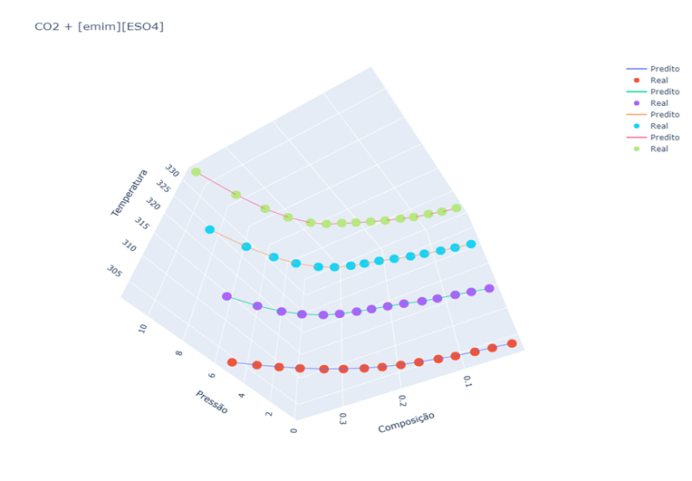

# Modelagem de Redes Neurais para o Cálculo do Equilíbrio Termodinâmico

## Introdução

As redes neurais são modelos matemáticos inspirados no funcionamento do cérebro humano, capazes de aprender e realizar tarefas complexas. Neste documento, exploraremos a modelagem de redes neurais, o princípio da aproximação universal e sua aplicação no cálculo do equilíbrio termodinâmico.

## Redes Neurais
Uma rede neural é composta por camadas de neurônios interconectados. Cada conexão possui um peso que é ajustado durante o processo de treinamento. As redes neurais podem ser utilizadas para aprender padrões, realizar classificação, regressão e muito mais.

## Princípio da Aproximação Universal

O princípio da aproximação universal afirma que uma rede neural com uma única camada oculta e número suficiente de neurônios pode aproximar qualquer função contínua em um espaço compacto. Isso implica que as redes neurais são modelos poderosos e flexíveis para representar relações complexas entre variáveis.

## Aplicação no Cálculo do Equilíbrio Termodinâmico

### Conceitos Termodinâmicos

Antes de explorar a aplicação das redes neurais, é crucial entender os conceitos termodinâmicos relevantes. Isso inclui propriedades como entalpia, entropia e energia livre.

### Modelagem com Redes Neurais

As redes neurais podem ser empregadas para modelar relações termodinâmicas complexas. Elas são capazes de aprender padrões a partir de conjuntos de dados, permitindo a predição de propriedades termodinâmicas com base em entradas específicas.

### Treinamento da Rede

Durante o treinamento, a rede neural ajusta os pesos das conexões para minimizar a diferença entre as previsões e os valores reais das propriedades termodinâmicas. Algoritmos de otimização, como o Gradiente Descendente, são comumente utilizados para este fim.

## Conclusão

A modelagem de redes neurais no contexto termodinâmico oferece uma abordagem inovadora e eficaz para calcular o equilíbrio termodinâmico. A flexibilidade das redes neurais as torna ferramentas poderosas na análise de sistemas complexos e na predição de propriedades físico-químicas.

